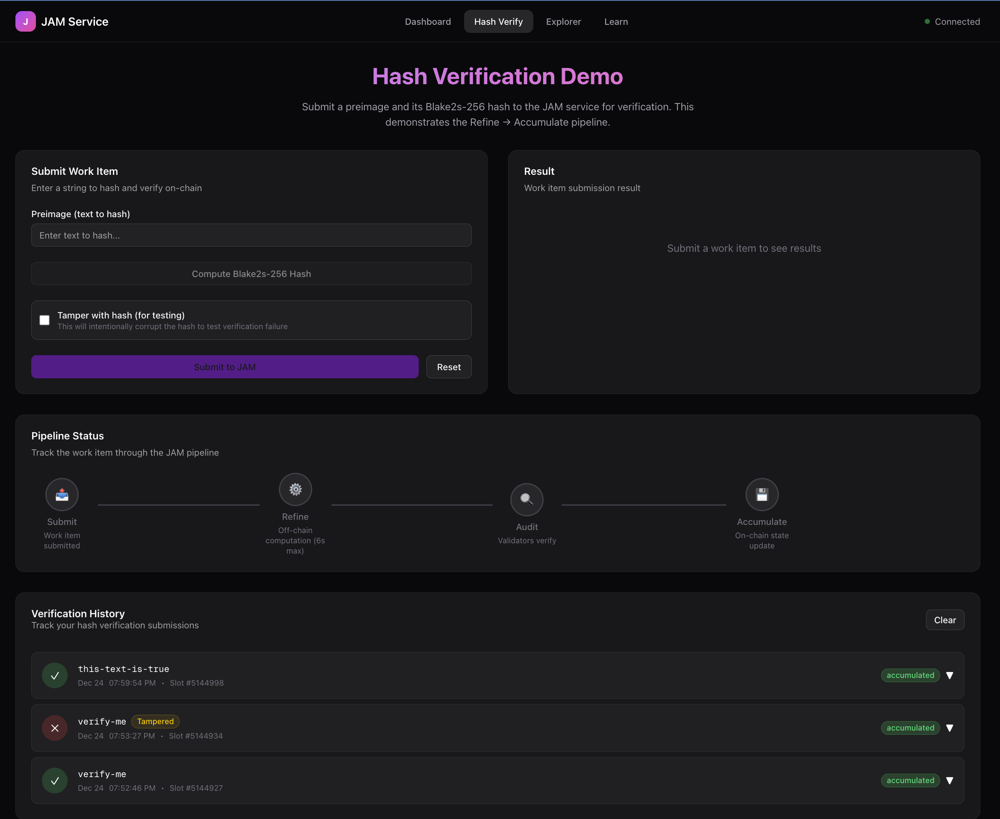
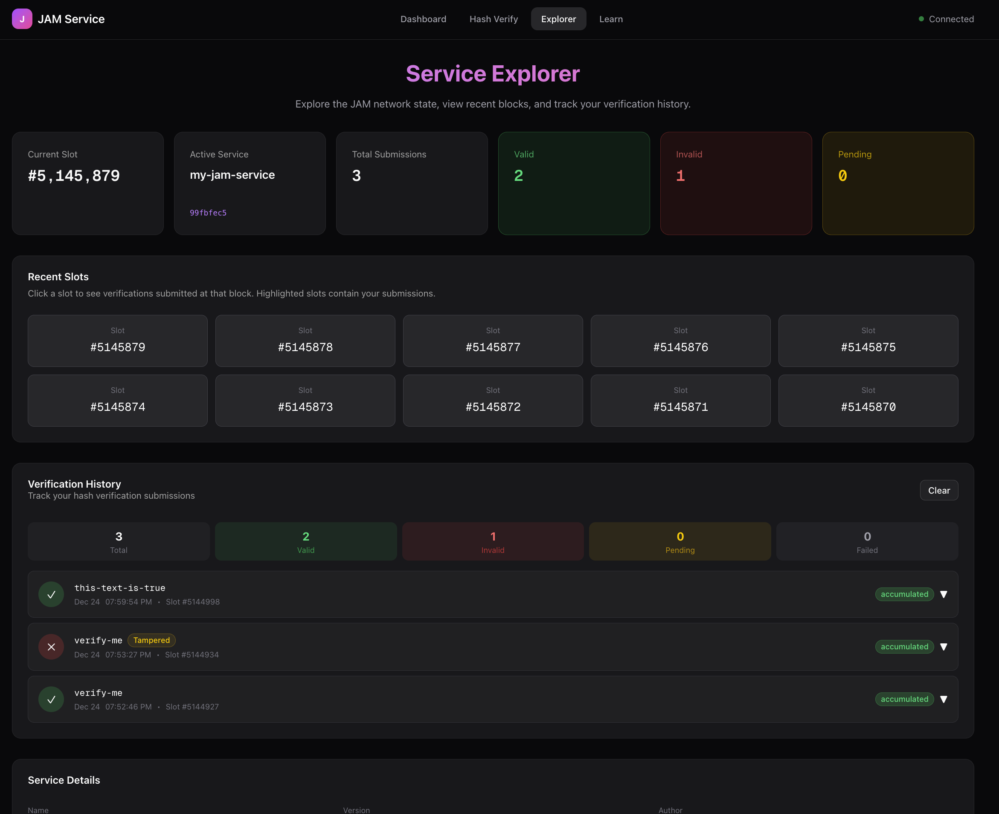
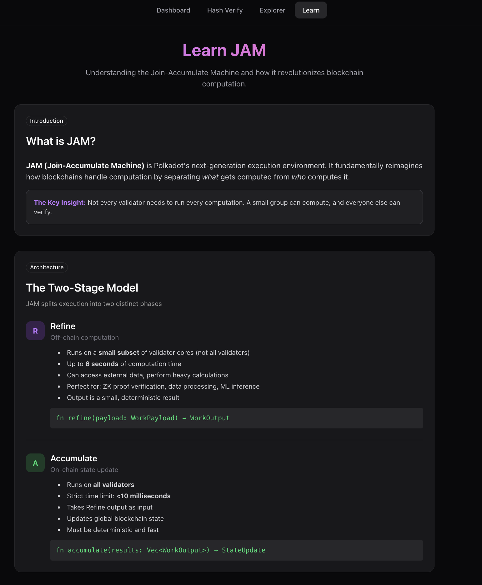

# zk-jam-service

**A ZK proof verification service for [JAM](https://graypaper.com) (Join-Accumulate Machine) — enabling trustless off-chain computation verification on Polkadot's next-generation architecture.**

[](./LICENSE)
[](#development-status)
[](https://graypaper.com)

## Overview

zk-jam-service demonstrates how JAM's unique **Refine → Accumulate** architecture enables verification of computationally expensive proofs on-chain. By separating heavy computation (6 seconds on validator cores) from fast state updates (<10ms on all validators), JAM allows verification workloads that are impossible on traditional blockchains.

**Current Implementation:** Blake2s-256 hash verification (proof-of-concept)
**Target Implementation:** Full ZK proof verification (RISC Zero, SP1, or Groth16)

```
┌─────────────────┐         ┌─────────────────────────────────┐         ┌──────────────┐
│   Off-Chain     │         │         JAM Network              │         │   On-Chain   │
│   Computation   │  submit │  ┌─────────┐    ┌────────────┐  │ finalize│    State     │
│                 │ ───────>│  │ REFINE  │───>│ ACCUMULATE │  │────────>│              │
│  Generate proof │  work   │  │  (6s)   │    │  (<10ms)   │  │         │  Immutable   │
│  (minutes/hours)│  item   │  │ Verify  │    │  Update    │  │         │   Receipt    │
└─────────────────┘         │  └─────────┘    └────────────┘  │         └──────────────┘
                            └─────────────────────────────────┘
```

## Problem Statement

**The Verification Bottleneck:** ZK proof verification typically requires 100ms–2s of computation. Traditional blockchains execute all code on every validator, making ZK verification prohibitively expensive or impossible at scale.

**JAM's Solution:** Only a small subset of validators run the expensive `refine()` computation, while all validators run the fast `accumulate()` state update. This 1000x reduction in redundant computation enables practical ZK verification on-chain.

**Why This Matters:**
- **Privacy-preserving applications** can prove statements without revealing data
- **Rollups and L2s** can settle proofs on Polkadot without full re-execution
- **AI/ML verification** can attest to model outputs trustlessly
- **Cross-chain bridges** can verify external chain state with ZK proofs

## Development Status

| Phase | Status | Description |
|-------|--------|-------------|
| **1. Infrastructure** | ✅ Complete | Project setup, CLI tooling, deployment pipeline |
| **2. Hash Verification** | ✅ Complete | Blake2s-256 verification demonstrating full pipeline |
| **2.5. Web Dashboard** | ✅ Complete | Interactive UI for demos and education |
| **3. ZK Integration** | 🔄 Next | Real ZK proof verification (RISC Zero/SP1) |
| **4. Production** | 📋 Planned | Error handling, benchmarking, security audit |
| **5. Advanced** | 🔮 Future | Batching, aggregation, cross-service proofs |

See [zk-proof-testing-plan.md](./zk-proof-testing-plan.md) for detailed technical roadmap.

## Technical Architecture

### Service Implementation (Rust, `no_std`)

```rust
// src/lib.rs - JAM Service Entry Points

fn refine(payload: WorkPayload) -> WorkOutput {
    // Runs on ONE validator core (up to 6 seconds)
    // ─────────────────────────────────────────────
    let expected_hash = &payload[..32];      // Extract claim
    let preimage = &payload[32..];           // Extract witness

    let computed = blake2s256(preimage);     // Heavy computation
    let is_valid = computed == expected_hash; // Verification

    return [is_valid, computed...];          // Result for accumulate
}

fn accumulate(results: Vec<WorkOutput>) {
    // Runs on ALL validators (<10 milliseconds)
    // ─────────────────────────────────────────────
    let count = get_storage(b"count") + results.len();
    set_storage(b"count", count);            // Fast state update
}
```

### Payload Format

```
┌──────────────────────────────────────────────────────────────────┐
│                         Work Payload                              │
├────────────────────────────────┬─────────────────────────────────┤
│   Expected Hash (32 bytes)     │      Preimage (N bytes)         │
│   "I claim hash(x) = H"        │      "Here is x"                │
└────────────────────────────────┴─────────────────────────────────┘
                                 │
                                 ▼
┌──────────────────────────────────────────────────────────────────┐
│                         Work Output                               │
├────────────────────────────────┬─────────────────────────────────┤
│   Result Code (1 byte)         │      Computed Hash (32 bytes)   │
│   0x01=valid, 0x00=invalid     │      Proof of computation       │
└────────────────────────────────┴─────────────────────────────────┘
```

### Project Structure

```
zk-jam-service/
├── src/lib.rs              # JAM service (Rust, no_std, PolkaVM target)
├── client/                 # CLI tooling (TypeScript)
│   └── src/
│       ├── hash-verify.ts  # Submit verifications
│       ├── query-state.ts  # Read service storage
│       └── monitor.ts      # Network monitoring
├── client/web/             # Web dashboard (Next.js 14)
│   └── src/app/
│       ├── verify/         # Interactive verification UI
│       ├── explorer/       # Block & history browser
│       └── learn/          # Educational content
└── zk-proof-testing-plan.md
```

## Quick Start

### Prerequisites

```bash
# Rust with RISC-V target
rustup target add riscv64imac-unknown-none-elf
cargo install jam-pvm-build

# Node.js 18+
node --version
```

### Build & Deploy

```bash
# 1. Build the service blob
jam-pvm-build

# 2. Start local 6-validator testnet
./polkajam-nightly/polkajam-testnet

# 3. Deploy service (returns Service ID)
./polkajam-nightly/jamt create-service zk-jam-service.jam

# 4. Submit a verification
cd client && npx tsx src/hash-verify.ts "hello world"
```

### Web Dashboard

```bash
cd client/web
npm install
npm run dev
# Open http://localhost:3000
```

| Page | Purpose |
|------|---------|
| `/` | Network status, pipeline visualization |
| `/verify` | Interactive hash verification with tamper testing |
| `/explorer` | Slot browser, verification history |
| `/learn` | JAM architecture education |

#### Web Dashboard screenshots

 <!-- Centered -->
  <p align="center">
    
  </p>

 <!-- Centered -->
  <p align="center">
    
  </p>

   <!-- Centered -->
  <p align="center">
    
  </p>


## Future Work: ZK Proof Integration

### Phase 3 Objectives

Replace hash verification with real ZK proof verification, enabling:

1. **Private Credential Verification** — Prove attributes without revealing data
2. **Computation Receipts** — Attest that specific programs ran correctly
3. **Cross-Chain State Proofs** — Verify external blockchain state on Polkadot

### ZK System Evaluation

| System | Proof Size | Verify Time | no_std | Best For |
|--------|------------|-------------|--------|----------|
| **RISC Zero** | ~200KB | ~100ms | ✅ | General computation |
| **SP1** | ~50KB | ~50ms | Partial | General computation |
| **Groth16** | ~200B | ~10ms | ✅ | Fixed circuits |

**Target:** RISC Zero for initial integration due to mature `no_std` support and alignment with PolkaVM's RISC-V architecture.

### Proposed Deliverables

1. **ZK Verifier Integration** — Add RISC Zero/SP1 verifier to service
2. **Proof Generation Tooling** — Off-chain prover CLI and examples
3. **Dashboard Updates** — ZK-specific UI (proof upload, public inputs display)
4. **Benchmarking** — Gas profiling, verification time analysis
5. **Documentation** — Integration guide for developers

## Use Cases

### Enabled by ZK + JAM

| Use Case | Description |
|----------|-------------|
| **ZK-Rollup Settlement** | Verify rollup state transitions on Polkadot |
| **Private Voting** | Prove vote eligibility without revealing identity |
| **AI Model Attestation** | Prove specific model produced specific output |
| **Credential Verification** | Prove age/citizenship without revealing documents |
| **Gaming** | Verify complex game state transitions off-chain |

### Why JAM (vs. Smart Contracts)

| Feature | Traditional Blockchain | JAM |
|---------|----------------------|-----|
| Verification time | ~10ms (all validators) | ~6s (few validators) |
| ZK verification | Impractical | Native support |
| Computation model | Every node executes | Compute once, verify many |
| Cost scaling | O(validators × computation) | O(computation) |

## Resources

- **[JAM Graypaper](https://graypaper.com)** — Technical specification
- **[Polkadot Wiki](https://wiki.polkadot.network/docs/learn-jam-chain)** — JAM overview
- **[jam-pvm-common](https://docs.rs/jam-pvm-common)** — Rust SDK documentation
- **[PolkaJam Releases](https://github.com/parity-tech/polkajam/releases)** — Node binaries

## Contributing

We welcome contributions! See individual module READMEs for development setup:
- [client/README.md](./client/README.md) — CLI tools
- [client/web/README.md](./client/web/README.md) — Web dashboard

## License

Apache-2.0 — See [LICENSE](./LICENSE)

---

<sub>Built with support from the Polkadot ecosystem. ZK integration roadmap aligned with [Web3 Foundation grant priorities](https://grants.web3.foundation/).</sub>
