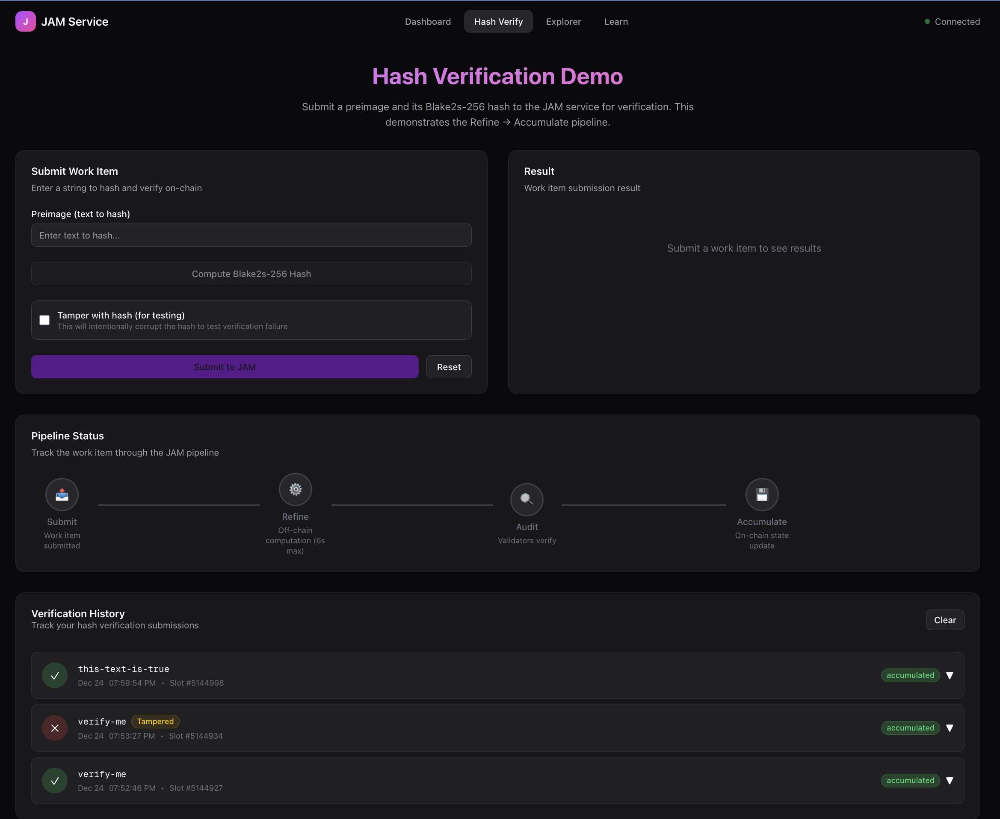

# zk-jam-service

**ZK proof verification for [JAM](https://graypaper.com) (Join-Accumulate Machine) — enabling trustless computation verification on Polkadot's next-generation architecture.**

> **What this is now: anonymous, sybil-resistant voting.** The original hash-verify
> demo was a wiring toy; the real app is a Groth16/BN254 circuit proving membership
> in an eligibility set + a nullifier, verified **in `refine`** (~60 M gas), with the
> tally and spent-nullifier registry in `accumulate`. The chain only ever sees
> `{nullifier, tally}` — never the voter; double-votes are rejected.
> `docker compose up --build` runs the voting service on a pulled JAM node + a prover
> sidecar + the `/vote` web UI — **no lasair source needed, any architecture** (see
> below). Why JAM verifies cheaply *in-protocol* (vs Aztec's client-side proving on
> scarce L1): [`docs/BLUEPRINT.md`](docs/BLUEPRINT.md). Circuit + service + prover:
> [`circuits/voting`](circuits/voting), [`services/voting`](services/voting).

## Run it on your architecture (one command, no lasair source)

You **don't need the lasair source** — the JAM node is pulled as a published,
**multi-arch** image (`ghcr.io/abutlabs/lasair-node`). Clone this repo and:

```sh
docker compose up --build          # -> open http://localhost:3000/vote
```

(`--build` is for *this* repo's prover + web app; the JAM node is pulled, not built.)

| Your machine | What runs | Notes |
|---|---|---|
| **Linux / amd64** (Intel/AMD) | native | — |
| **Apple Silicon** (M1–M4, arm64) | native | the node image is built for arm64 too |
| **Windows / WSL2** (amd64) | native | run inside a WSL2 Linux shell |
| **arm64 without an arm64 image yet** | emulated | add `--platform linux/amd64` (slower) |

Cast a ballot in the UI: a ZK proof is generated by the prover, verified **in JAM's
`refine`**, and tallied in `accumulate`. The chain stores only `{nullifier, tally}`.

Want the **live 6-validator colour-coded testnet** hosting the service instead?

```sh
docker compose -f docker-compose.testnet.yml up --build
```

(Pulls `ghcr.io/abutlabs/lasair-testnet-node`; that GHCR package must be public —
if you hit an auth error, use the single-node default above.)

> **JAM-client teams:** the voting service is self-contained — nothing is baked into
> the client (every host-call is ZERO crypto; the Groth16 verifier is in the blob).
> Point `LASAIR_RPC` at your own node's deploy/work-item RPC and run the same flow.

[](./LICENSE)
[](https://graypaper.com)

```
┌─────────────────┐         ┌─────────────────────────────────┐         ┌──────────────┐
│   Off-Chain     │         │         JAM Network              │         │   On-Chain   │
│   Prover        │  submit │  ┌─────────┐    ┌────────────┐  │ finalize│    State     │
│                 │ ───────>│  │ REFINE  │───>│ ACCUMULATE │  │────────>│              │
│  Generate proof │  work   │  │  (6s)   │    │  (<10ms)   │  │         │  Immutable   │
│                 │  item   │  │ Verify  │    │  Update    │  │         │   Receipt    │
└─────────────────┘         │  └─────────┘    └────────────┘  │         └──────────────┘
                            └─────────────────────────────────┘
```

**Why JAM?** Traditional blockchains run all code on every validator (~10ms budget). JAM runs heavy computation on a few validators (6s budget), then all validators update state (<10ms). This 1000x reduction in redundant computation makes ZK verification practical.

## Polkajam

Running this repo (Polkajam mode) requires you to download and extract polkajam nightly build to the project root `polkajam-nightly/*`

## Core Logic

```rust
// src/lib.rs — The "Aha!" moment

fn refine(payload: WorkPayload) -> WorkOutput {
    // Runs on ONE validator core (up to 6 seconds)
    let expected_hash = &payload[..32];
    let preimage = &payload[32..];

    let computed = blake2s256(preimage);  // Heavy computation here
    let is_valid = computed == expected_hash;

    [is_valid as u8, computed...].into()
}

fn accumulate(results: Vec<WorkOutput>) {
    // Runs on ALL validators (<10 milliseconds)
    let count = get_storage(b"count") + results.len();
    set_storage(b"count", count);  // Fast state update
}
```

## ZK Verification Strategy

**The challenge:** The best ZK implementations (Barretenberg, libsnark) are in C++, but JAM requires `no_std` Rust for PolkaVM.

**Our approach:**

| Path | Library | Status |
|------|---------|--------|
| **Primary** | Arkworks (Rust) | Groth16, full `no_std`, ~5ms verification |
| **Research** | Barretenberg (C++) | Investigating RISC-V compilation for PVM |

We're not building new ZK systems—we're building the PVM-compatible wrapper that lets JAM verify proofs from battle-tested ecosystems. See [grant-proposal.md](./grant-proposal.md) for the full integration strategy.

## Running the full stack

The app is three tiers — a **JAM service** (Rust → PolkaVM), a **JAM node** that
runs it, and a **front-end** (a Next.js web dashboard + a TypeScript CLI) that
submits work and reads results. The front-end reaches whichever node you choose
through a backend switch (the `JAM_BACKEND` env var):

| `JAM_BACKEND` | Node | How the front-end reaches it |
|---------------|------|------------------------------|
| `lasair` | **Lasair** — an original-work OCaml JAM client (`ghcr.io/abutlabs/lasair-node`) | HTTP operator RPC at `LASAIR_RPC` (`:19900`) |
| `polkajam` *(CLI default)* | **PolkaJam** reference node (`polkajam-nightly`) | shells the bundled `jamt` CLI over `ws://localhost:19800` |

The **same** service blob (`zk-jam-service.jam`) runs unchanged on either node —
that's the whole point: if Lasair is conformant, a service proven on PolkaJam
behaves byte-identically on Lasair. Pick a path:

---

### Option A — Lasair, one command (`docker compose up`)

Runs the entire stack on **Lasair** in containers — the node, a one-shot deploy,
and the dashboard — with nothing to build or install locally:

```bash
docker compose up
# then open http://localhost:3000  (service id 1729 is pre-deployed → go to /verify)
```

`docker-compose.yml` brings up three services:

| Service | Image | Role |
|---------|-------|------|
| `lasair-node` | `ghcr.io/abutlabs/lasair-node` | the JAM node; hosts the service, HTTP RPC on `:19900` (healthcheck-gated) |
| `deploy` | `node:20-slim` (one-shot) | waits for the node, POSTs `zk-jam-service.jam` → **service id 1729** |
| `web` | `ghcr.io/abutlabs/zk-jam-service-web` | the Next.js dashboard, `JAM_BACKEND=lasair`, on `:3000` |

> **The GHCR images must be public** — or run `docker login ghcr.io` first. The
> packages are `lasair-node` and `zk-jam-service-web` under `abutlabs`. (The web
> image also has a local `build: ./client/web` fallback in the compose file, so it
> builds itself if the published image isn't pullable.)

Want to drive the node directly? The operator RPC is plain HTTP/JSON:

```bash
curl -s localhost:19900/v1/head                                  # node alive + head slot
# submit a verification — payload = blake2s256("hello") ++ "hello":
curl -s -XPOST localhost:19900/v1/service/1729/item \
  -H content-type:application/json \
  -d '{"payload_hex":"19213bacc58dee6dbde3ceb9a47cbb330b3d86f8cca8997eb00be456f140ca2568656c6c6f"}'
# -> {"verdict":"valid","refine_output_hex":"...","storage":[...]}
curl -s localhost:19900/v1/service/1729/storage/636f756e74        # read "count" -> value hex
```

To point the **CLI** (`client/`) or a locally-run dashboard at Lasair instead of
PolkaJam, just flip the backend env vars (no code change):

```bash
export JAM_BACKEND=lasair LASAIR_RPC=http://localhost:19900
cd client && npm install
JAM_SERVICE_ID=1729 npx tsx src/hash-verify.ts --preimage "hello" --submit
JAM_SERVICE_ID=1729 npx tsx src/query-state.ts count
```

---

### Option B — PolkaJam (local reference binaries)

Runs the stack against the bundled **PolkaJam** reference node. The front-end never
talks to the service directly here: it shells out to the `jamt` CLI, which speaks
WebSocket RPC to the node at `ws://localhost:19800`.

```
 Web UI (:3000)  ──server action──▶  jamt  ──ws://localhost:19800──▶  polkajam node
   /verify            spawns                                            ├─ refine()   verify hash
   CLI (client/)                                                        └─ accumulate() write storage
        ▲                                                                        │
        └──────────────  jamt inspect best storage  ◀───────────────────────────┘
```

**Prerequisites:** Rust with the `riscv64imac-unknown-none-elf` target +
[`jam-pvm-build`](https://crates.io/crates/jam-pvm-build), and Node.js 18+ (for the
front-end). The `polkajam-nightly/` binaries are prebuilt and bundled.

### 1. Build the service

```bash
rustup target add riscv64imac-unknown-none-elf
cargo install jam-pvm-build
jam-pvm-build                       # -> zk-jam-service.jam
```

### 2. Start the local JAM node (terminal 1)

```bash
./polkajam-nightly/polkajam-testnet     # RPC ws://localhost:19800, validators on :40000+
```

### 3. Deploy the service — **with an endowment** (terminal 2)

```bash
./polkajam-nightly/jamt create-service zk-jam-service.jam 10000000000
# -> "Service <id> created at slot ..."   (note the 8-hex service id)
```

> ⚠️ **The endowment amount is required.** `create-service` defaults the amount to
> `0`; with a zero balance the service's `accumulate` cannot pay the storage
> deposit and its writes are **silently dropped** (the node logs `Balance too low
> for storage change`, and `count`/`status` never appear). Pass a non-zero amount
> (e.g. `10000000000`).

### 4a. Submit + read back from the CLI

```bash
# blake2s256("hello") ++ "hello"  (a VALID verification)
PAYLOAD=0x19213bacc58dee6dbde3ceb9a47cbb330b3d86f8cca8997eb00be456f140ca2568656c6c6f
./polkajam-nightly/jamt item <SERVICE_ID> $PAYLOAD

# read the on-chain result (keys are raw ascii in hex)
./polkajam-nightly/jamt inspect best storage <SERVICE_ID> 0x636f756e74   # "count"  -> 0x02
./polkajam-nightly/jamt inspect best storage <SERVICE_ID> 0x737461747573 # "status" -> "accumulated"
```

Or via the typed CLI in `client/` (same RPC, `ws://localhost:19800`):

```bash
cd client && npm install
JAM_SERVICE_ID=<SERVICE_ID> npx tsx src/hash-verify.ts --preimage "hello" --submit
JAM_SERVICE_ID=<SERVICE_ID> npx tsx src/query-state.ts count
```

### 4b. Or run the web dashboard (terminal 3)

```bash
cd client/web && npm install && npm run dev
# open http://localhost:3000, set the service id, go to /verify
```

| Page | Purpose |
|------|---------|
| `/` | Network status, pipeline visualization |
| `/verify` | Interactive hash verification |
| `/explorer` | Slot browser, verification history |
| `/learn` | JAM architecture education |

> **Note on the UI:** the submit→refine→audit→accumulate pipeline animation on
> `/verify` is a client-side visualization (fixed timers) — it shows progress
> regardless of on-chain timing. The *real* result is what the service wrote to
> storage; the dashboard reads it back with `jamt inspect best storage`. (Verified
> end-to-end: a `hello` submission against an endowed service yields
> `count` and `status="accumulated"` on chain.)

<p align="center">
  
</p>

## Testing & Benchmarking

**Dual-tier testing strategy:**

| Tier | Tool | Purpose |
|------|------|---------|
| **Execution** | Rust `criterion` | Measure `refine()` cycle counts, memory in PVM |
| **Load** | k6 | Simulate concurrent submissions, end-to-end latency |

**Target metrics:**

| Proof System | Native | PVM | Fits 6s? |
|--------------|--------|-----|----------|
| Groth16 | ~5ms | TBD | TBD |
| PLONK | ~30ms | TBD | TBD |

## Project Structure

```
zk-jam-service/
├── src/lib.rs              # JAM service (Rust, no_std, PolkaVM)
├── zk-jam-service.jam      # prebuilt service blob (runs on PolkaJam *or* Lasair)
├── client/                 # CLI tooling (TypeScript)
│   └── src/
│       ├── backends/       # the polkajam | lasair switch (JAM_BACKEND)
│       │   ├── polkajam.ts # shells the jamt CLI
│       │   └── lasair.ts   # HTTP operator RPC (LASAIR_RPC)
│       ├── hash-verify.ts  # Submit verifications
│       └── query-state.ts  # Read service storage
├── client/web/             # Web dashboard (Next.js); same backend switch
├── docker-compose.yml      # one-command Lasair stack (node + deploy + web)
└── grant-proposal.md       # Web3 Foundation grant application
```

## Development Status

| Phase | Status | Description |
|-------|--------|-------------|
| 1. Infrastructure | ✅ | Project setup, deployment pipeline |
| 2. Hash Verification | ✅ | Blake2s-256 verification (proof-of-concept) |
| 2.5. Web Dashboard | ✅ | Interactive UI, educational content |
| 3. ZK Integration | 🔄 | Real ZK proof verification |
| 4. Benchmarking | 📋 | Performance analysis, optimization |

## Use Cases

| Use Case | Description |
|----------|-------------|
| **ZK-Rollup Settlement** | Verify rollup state transitions on Polkadot |
| **Private Voting** | Prove eligibility without revealing identity |
| **Credential Verification** | Prove age/citizenship without documents |
| **AI Attestation** | Prove specific model produced specific output |

## Resources

- [JAM Graypaper](https://graypaper.com) — Technical specification
- [Polkadot Wiki](https://wiki.polkadot.network/docs/learn-jam-chain) — JAM overview
- [Arkworks](https://arkworks.rs/) — ZK library documentation
- [zk-proof-testing-plan.md](./zk-proof-testing-plan.md) — Detailed technical roadmap

## The abutlabs JAM suite

Three things we built on JAM — an independent client and two flagship services on
it, each one-command-runnable:

- **[lasair](https://github.com/abutlabs/lasair)** — an independent OCaml JAM client
  (+ a live multi-node testnet that runs like PolkaJam).
- **[zk-jam-service](https://github.com/abutlabs/zk-jam-service)** — this: anonymous,
  sybil-resistant voting; a real ZK proof verified in `refine`.
- **[jamswap](https://github.com/abutlabs/jamswap)** — a frequent-batch-auction
  order-book DEX; matching in `refine`, MEV-resistant, settlement on-chain.

## License

Apache-2.0 — See [LICENSE](./LICENSE)

---

<p align="center">
  <sub>Built as a public good for the Polkadot ecosystem</sub>
</p>
